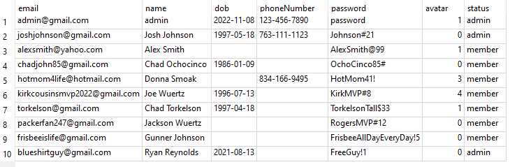
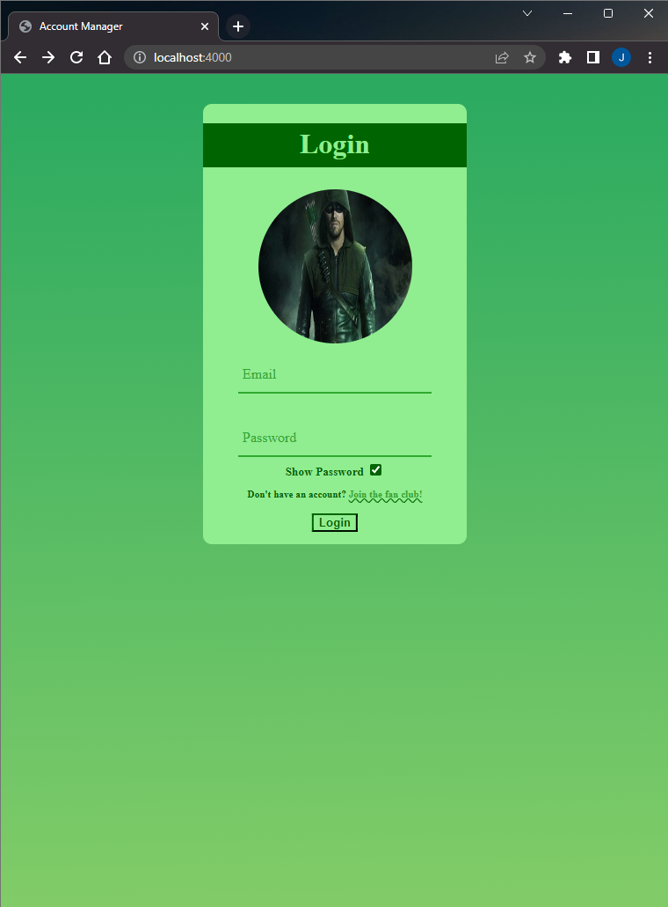
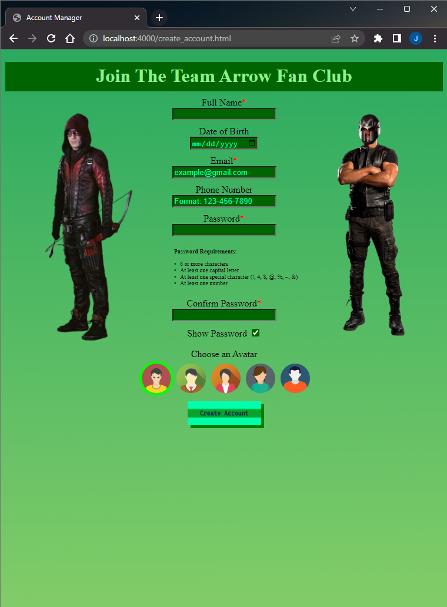

<h1 align="center">:raising_hand_man: Account Manager :raising_hand_man:</h1>

    Allows a user to create&sol;delete accounts and be able to login&sol;logout of such accounts with special privileges based on user permissions

---
<!-- instructions section -->
<h2 align="center">:scroll: Instructions of how to run program :scroll:</h2>

&nbsp;**Downloading The Project Folder**

&nbsp;**Option 1:** Inclusively download this project along with entire portfolio from home page

    1.) On portfolio homepage, open the dropdown box called '<> Code'

    2.) Within the dropdown box, click on Download ZIP

    3.) Open the zip file that was just downloaded

    4.) Unzip the file downloaded by clicking 'Extract all'

&nbsp;**Option 2:** Exclusively download the Chess project

    1.) Click on the link provided below

    2.) Download Account_Manager.zip that was pulled up on Google Drive after clicking link

    3.) Open the zip file that was just downloaded

    4.) Unzip the file downloaded by clicking 'Extract all'

&nbsp;<a href="https://drive.google.com/file/d/1OuLaSrKU5NHVH5S5YiewJQU9sD52HNYz/view?usp=drive_web">Download Account Manager Project</a>

&nbsp;**Running The Program**

&nbsp;*Requires NodeJS*

    1.) Open command line and traverse to the Account_Manager folder that was downloaded

    2.) Run node js by using the command 'node app.js' within the Account_Manager folder in the terminal

    3.) Open web browser and go to localhost:4000 (port 4000 is chosen within the app.js file and is possible to change port address if desired)
    
    4.) Operate at that address the same as one would at a website on the browser

---
<!-- project images section -->
<h2 align="center">:camera: Project Images :camera:</h2>

**Database Data** 

**Database Structure** 

**Login Page** 

https://user-images.githubusercontent.com/107897805/203902640-56156c82-bb81-40bb-86b6-8abf0646dc15.mp4

**Create An Account** 

**Member Logged In** 

**Admin Logged In** 

**Timeline** 

<!-- footer section -->

    
:arrow_up: <a href="#raising_hand_man-account-manager-raising_hand_man">Back to top</a> :arrow_up:

