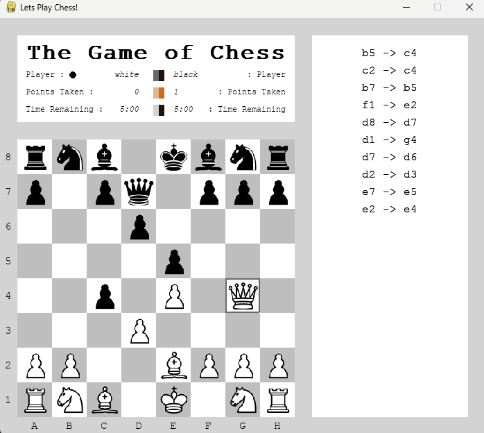
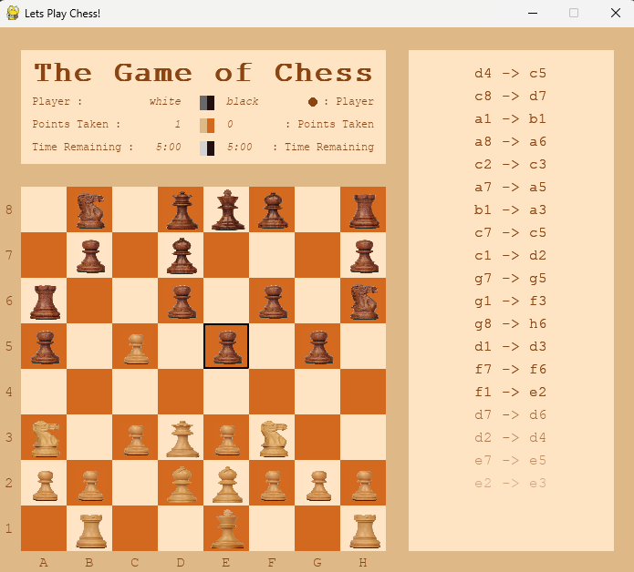
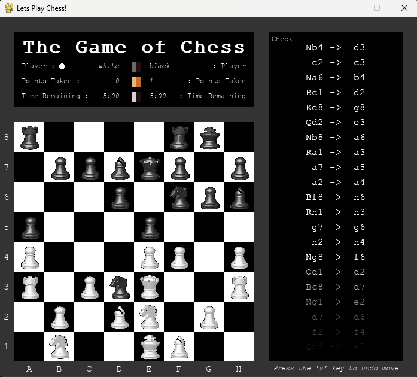

<h1 align='center'>:chess_pawn: Chess :chess_pawn:</h1>

    Custom made chess game that can be played on 3 different chess sets

---
<!-- instruction section -->
<h2 align='center'>:scroll: Instructions of how to run program :scroll:</h2>
    
&nbsp;**Option 1:** Inclusively download this project along with entire portfolio from home page

    1.) Run the executable file named Chess.exe to open the GUI (Graphical User Interface) for the program

    2.) Have fun playing Chess!

&nbsp;**Option 2:** Exclusively download the Chess project

    1.) Click on the link provided below. 
    This link will go to a Google Drive account and will then automatically download and unzip the zip folder called Chess. 
    This folder will contain all the data that the program needs

    2.) Open the folder that was just created called Chess

    3.) Run the executable file named Chess.exe

    4.) Have fun playing Chess!
&nbsp;<a href="https://drive.google.com/file/d/1wSiQ92ElvD-ROAYk44QLolnZ_bJKa0yu/view?usp=drive_web">Play Chess!</a>

---
<h2 align='center'>:point_up: Program Additions Since Executable Created :point_up:</h2>

- [ ] not implemented 
- [x] implemented

 

- [x] Clickable Help button display
    - [ ] Defines the game of chess and how to play
    - [ ] Defines end game conditions (checkmate/stalemate/player game clock forfeit)
    - [ ] Explain the time constrains on a player and time given per move
    - [ ] How to restart/start a new game
    - [ ] How to change themes (chess sets)
    - [ ] How to undo a move (pressing 'u' character)
- [x] Clickable en passant button display
    - [ ] Enable en passant chess move
    - [ ] Change background color of button to indicate enabled
- [x] Clickable button for valid moves
    - [ ] Displays the available moves at that given time
- [x] Clickable button for game clock settings
    - [ ] Provide 3 premade options and 1 custom text box before game start for the time allowed for each player
    - [ ] Toggles on and off player game timers
    - [ ] Ability to pause game timers
- [ ] Each player has their own game clock for time remaining on their turns
- [ ] Pawns transform to desired piece by clicking on an image of available pieces in a pop-up display instead of always being a queen
- [ ] Create a displayed countdown for moves until stalemate on gui when king is only piece left; all ally pieces have been caputured
---
<h2 align='center'>:camera: Chess Sets :camera:</h2>

**Theme 1** 

**Theme 2** 

**Theme 3** 

<!-- footer section -->

    
:arrow_up: <a href="#chess_pawn-Chess-chess_pawn">Back to top</a> :arrow_up:

