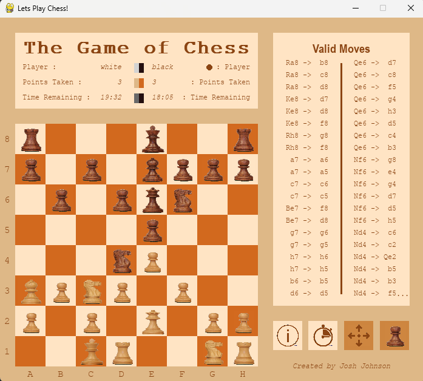

<h1 align='center'>:chess_pawn: Chess :chess_pawn:</h1>

    Custom made chess app that can be played on 3 different chess sets (themes). This chess app also contains additional features 
    such as the ability to enable and disable game clocks as well as the en passant rule, keeping player scores, and 
    accessing the list of available moves the current player can make.

---
<!-- instruction section -->
<h2 align='center'>:scroll: Instructions of how to run program :scroll:</h2>

&nbsp;**Downloading The Project Folder**

&nbsp;**Option 1:** Inclusively download this project along with entire portfolio from home page

    1.) On portfolio homepage, open the dropdown box called '<> Code'

    2.) Within the dropdown box, click on Download ZIP

    3.) Open the zip file that was just downloaded

    4.) Unzip the file downloaded by clicking 'Extract all'

&nbsp;**Option 2:** Exclusively download the Chess project

    1.) Click on the link provided below

    2.) Download Account_Manager.zip that was pulled up on Google Drive after clicking link

    3.) Open the zip file that was just downloaded

    4.) Unzip the file downloaded by clicking 'Extract all'

&nbsp;<a href="https://drive.google.com/file/d/1j7yMjDVD1lZuNrEZI-7gKghA7E9bHbnL/view?usp=drive_web">Download Chess!</a>

&nbsp;**Running The Program**

&nbsp;*Currently works only on Windows OS - macOS version coming soon*

    1.) Open the folder called Chess

    2.) Run the executable file named 'Chess.exe'

    3.) Have fun playing Chess!

---
<h2 align='center'>:camera: Project Images :camera:</h2>

**Game Log** 

**Help Menu** 

**Valid Moves** 

**Game Clock** 

<!-- footer section -->

    
:arrow_up: <a href="#chess_pawn-Chess-chess_pawn">Back to top</a> :arrow_up:

