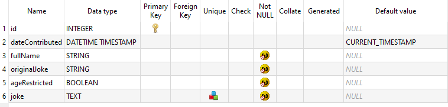
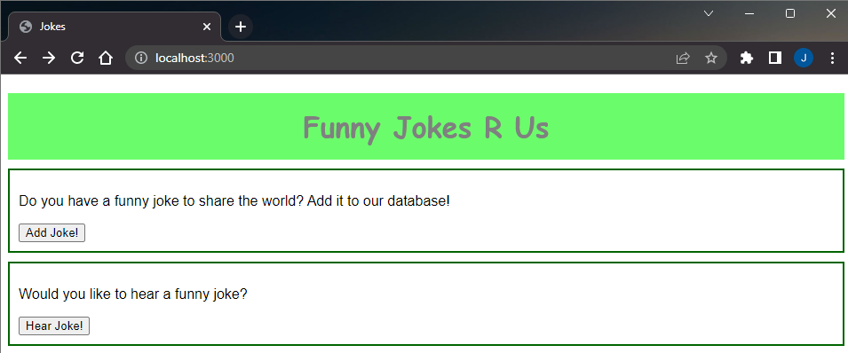
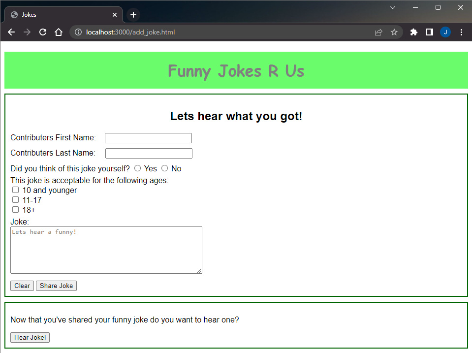
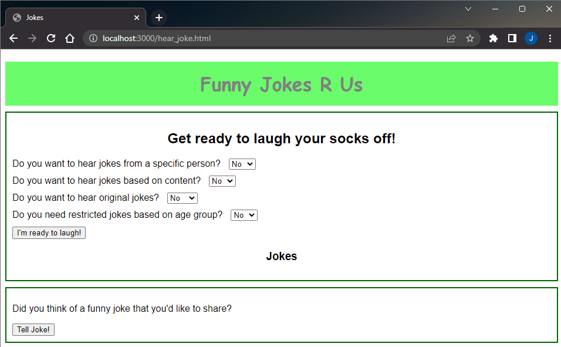
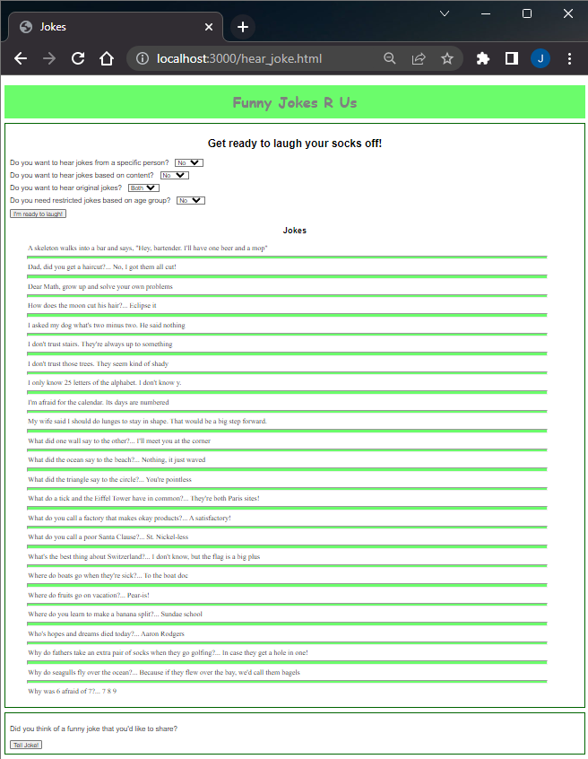

<h1 align="center">:clown_face: Jokes Project :clown_face:</h1>

    Keeps a database of jokes that users can add jokes to and&sol;or retrieve jokes from

---
<!-- instructions section -->
<h2 align="center">:scroll: Instructions of how to run program :scroll:</h2>

<h3>Downloading The Project Folder</h3>

&nbsp;**Option 1:** Inclusively download this project along with entire portfolio from home page

    1.) On portfolio homepage, open the dropdown box called '<> Code'

    2.) Within the dropdown box, click on Download ZIP

    3.) Open the zip file that was just downloaded

    4.) Unzip the file downloaded by clicking 'Extract all'

&nbsp;**Option 2:** Exclusively download the Chess project

    1.) Click on the link provided below

    2.) Download Jokes_Project.zip that was pulled up on Google Drive after clicking link

    3.) Open the zip file that was just downloaded

    4.) Unzip the file downloaded by clicking 'Extract all'

<a href="https://drive.google.com/file/d/1_4UapGtmXYTD7kTH-wyz8KZM83A4IrM4/view?usp=drive_web">Download Jokes Project</a>

<h3>Running The Program</h3>

&nbsp;*Requires NodeJS*

    1.) Open command line and traverse to the Jokes_Project folder that was downloaded

    2.) Run node js by using the command 'node app.js' within the Jokes_Project folder in the terminal

    3.) Open web browser and go to localhost:3000 (port 3000 is chosen within the app.js file and is possible to change port address if desired)
    
    4.) Operate at that address the same as one would at a website on the browser

---
<!-- project images section -->
<h2 align="center">:camera: Project Images :camera:</h2>

https://user-images.githubusercontent.com/107897805/200720588-2da7f5c6-7be8-49d8-b06a-7d61253faf84.mp4

**Database Data** 

**Database Structure** 

**Homepage** 

**Add Joke** 

**Hear Jokes Initial** 

**Hear Jokes Expanded All** 

**Hear Jokes Results** 

 

<!-- footer section -->

    
:arrow_up: <a href="#clown_face-jokes-project-clown_face">Back to top</a> :arrow_up:

