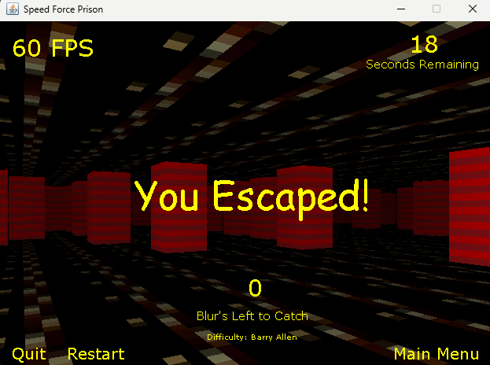
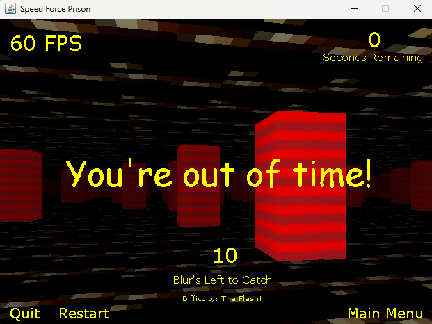

<h1 align="center">:video_game: Speed Force Prison Game :video_game:</h1>

    This program is a 3&ndash;Dimensional game written in Java that uses Java&apos;s graphical interface for rendering effects.

---
<!-- instructions section -->
<h2 align="center">:scroll: Instructions of how to run program :scroll:</h2>

&nbsp;**Option 1:** Programming tool Java installed

    1.) Run the executable file named Speed_Force_Prison_Game.exe to start the program

    2.) Godspeed!

&nbsp;**Option 2:** No programming tools installed on running computer

    1.) Click on the link provided below. 
    This link will go to a Google Drive account and will then automatically download and unzip the zip folder called Speed_Force_Prison_Game. 
    This folder will contain all the data that the program needs

    2.) Open the folder that was just created called Speed_Force_Prison_Game

    3.) Run the executable file named Speed_Force_Prison_Game.exe

    4.) Godspeed!
&nbsp;<a href="https://drive.google.com/file/d/1Wx036bJ-y3XwRefkbZh30_fOGDkvd7Iy/view?usp=drive_web">Play Chess!</a>

---
<!-- project progression images section -->
<h2 align="center">:chart_with_upwards_trend: Game Progression :chart_with_upwards_trend:</h2>

:arrow_down:

:arrow_down:

:arrow_down:

:arrow_down:

:arrow_down:

:arrow_down:

:arrow_down:

:arrow_down:

:arrow_down:

:arrow_down:

<h2 align="center">:white_check_mark: Final State :white_check_mark:</h2>

 

<!-- footer section -->

    
:arrow_up: <a href="#video_game-speed-force-prison-game-video_game">Back to top</a> :arrow_up:

