<h1 align='center'>:chart_with_upwards_trend: Stock Tracker! :chart_with_upwards_trend:</h1>

    App used to provide notifications on big stock price changes within a watchlist created by the user. Available cross platform

---

<!-- how to download section -->
<h2 align='center'>:scroll: How To Download :scroll:</h2>

***Available on Android, Windows, macOS and IOS***

    Coming soon

---

<!-- project images -->
<h2 align='center'>:camera: Project Images :camera:</h2>

<!-- android -->
<h3 align='center'>Android OS</h3>

<h4 align='center'>Pixel Phone</h4>

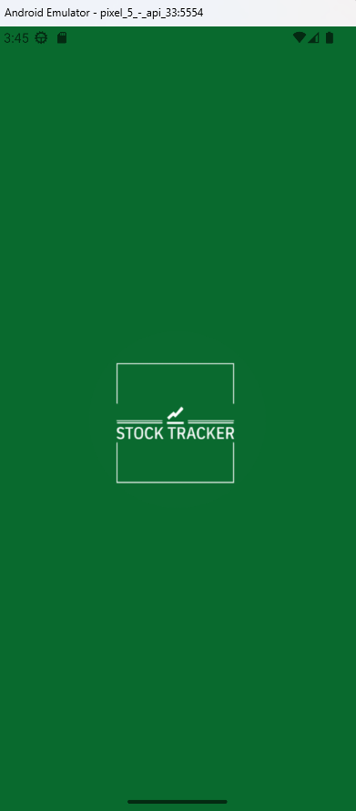
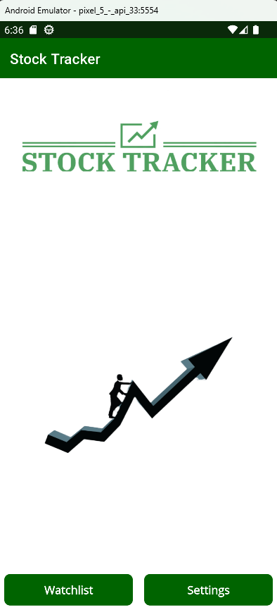
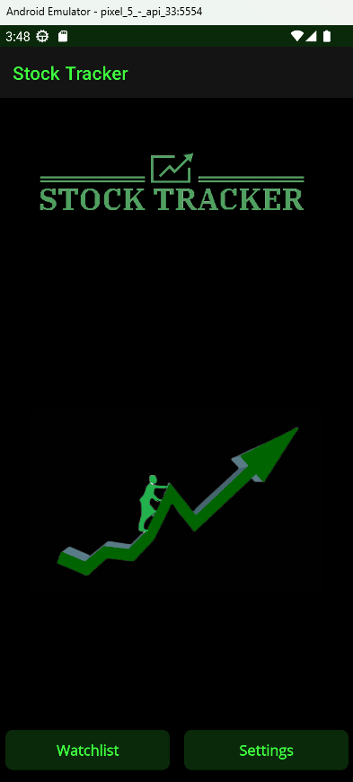

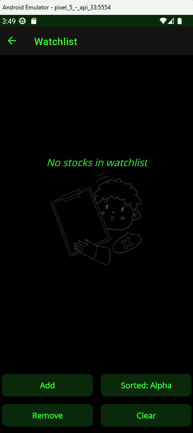
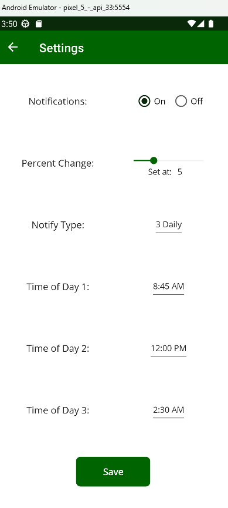
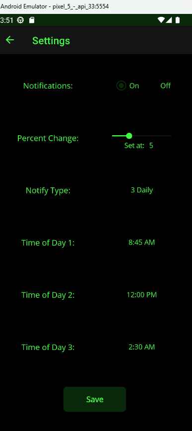

<h4 align='center'>Tablet</h4>

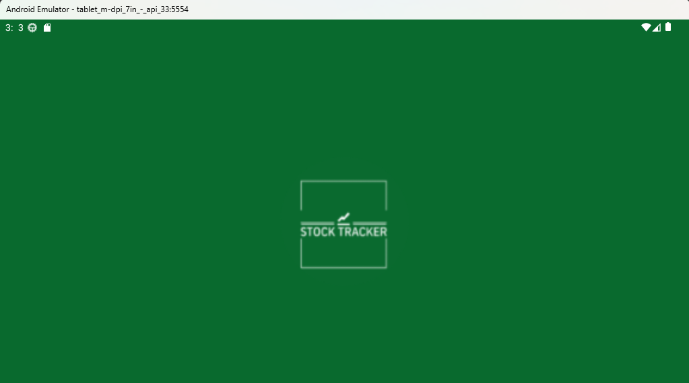
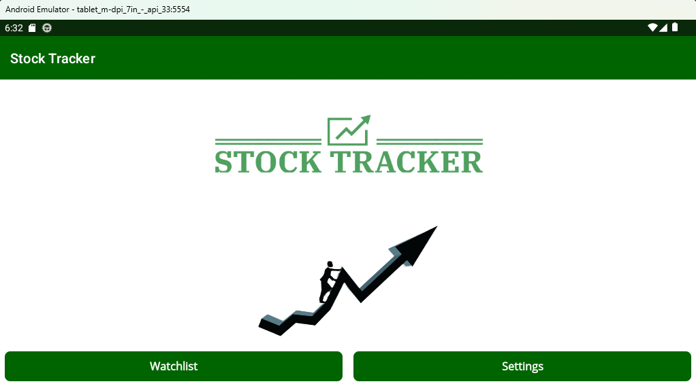
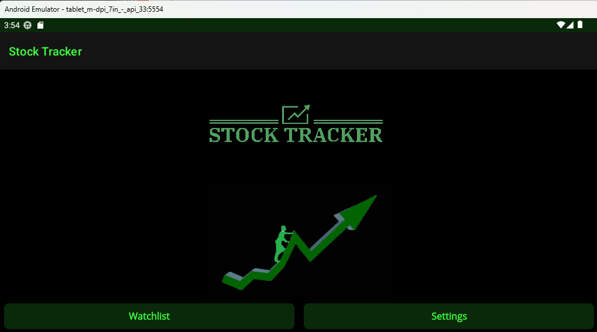
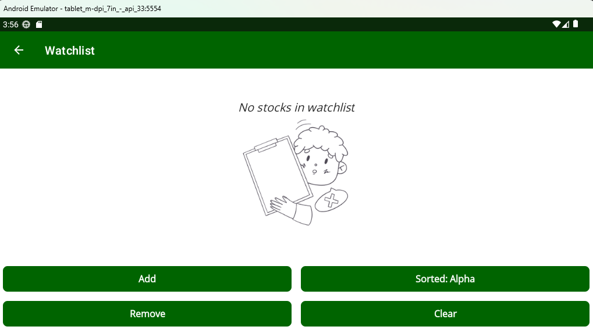
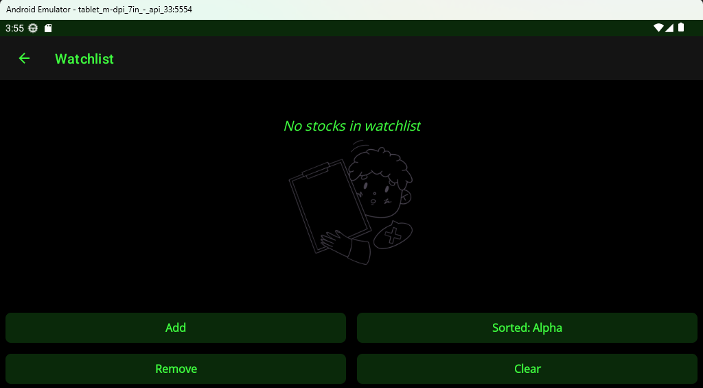
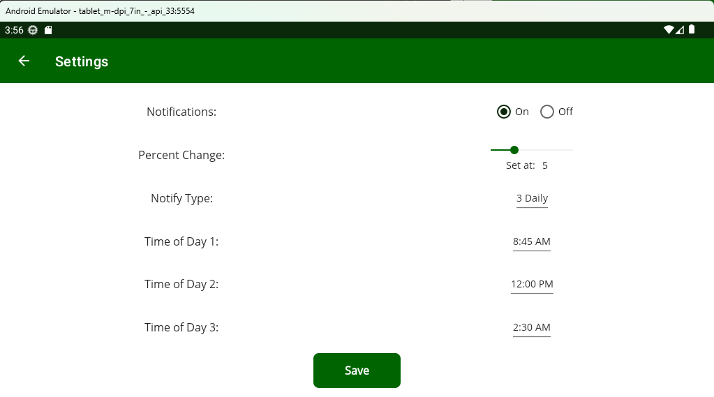

---

<!-- windows -->
<h3 align='center'>Windows OS</h3>

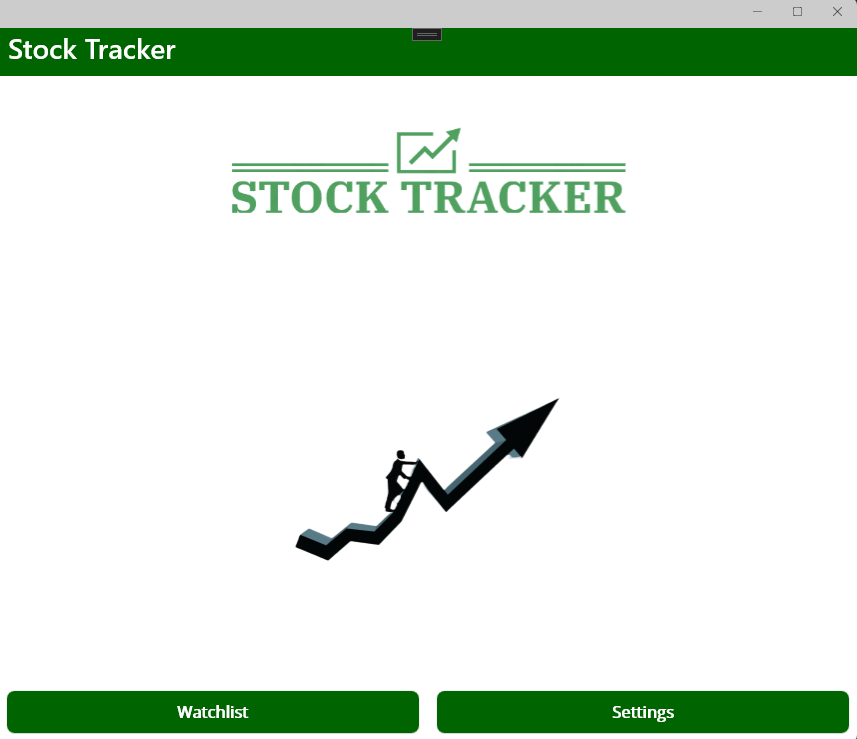
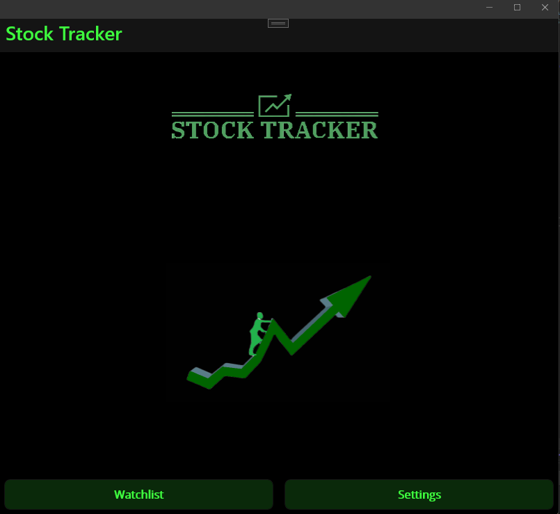
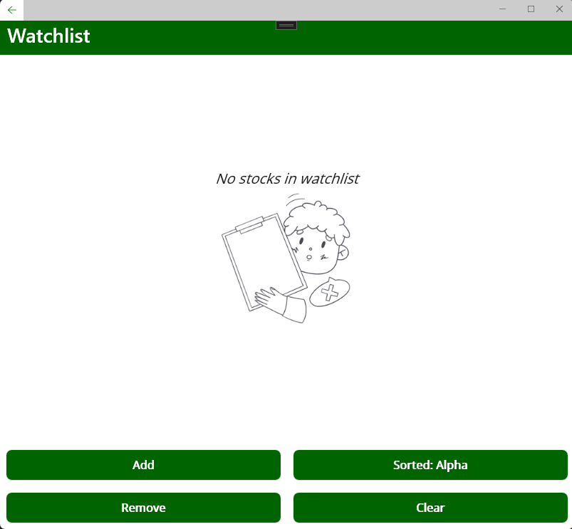
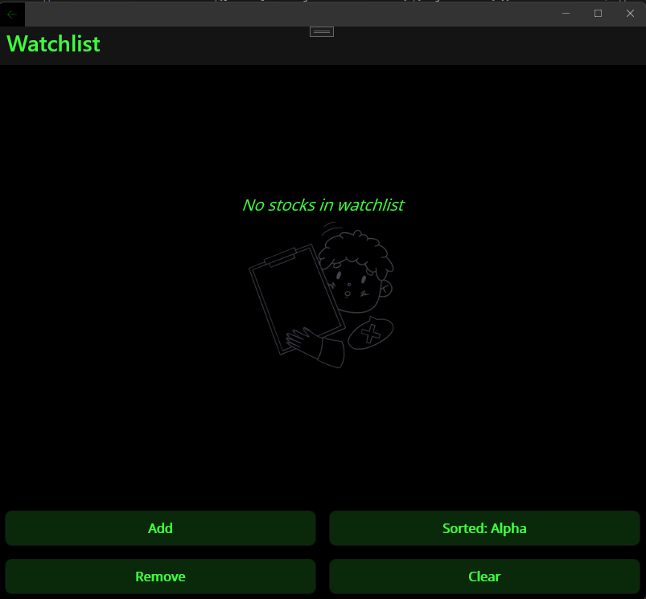
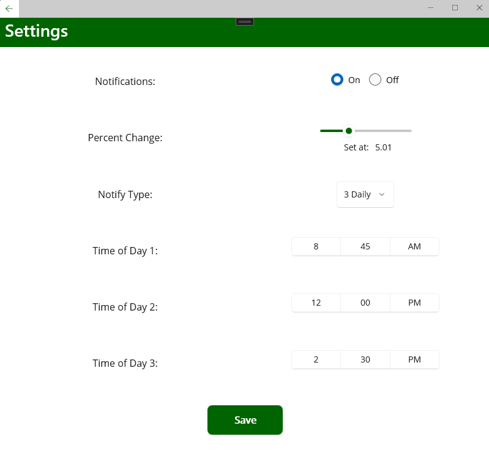
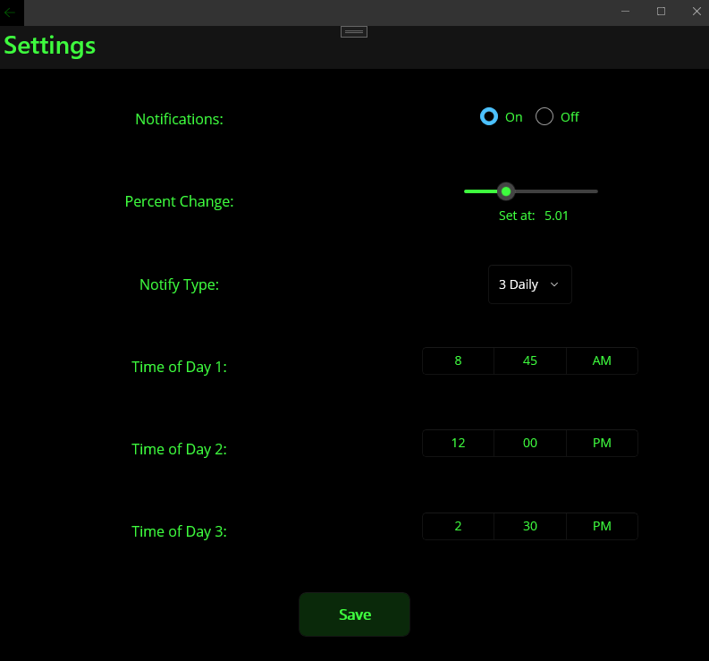

 

    
:arrow_up: <a href="#chart_with_upwards_trend-stock-tracker-chart_with_upwards_trend">Back to top</a> :arrow_up:

