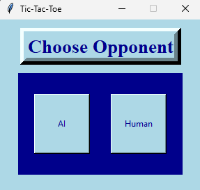
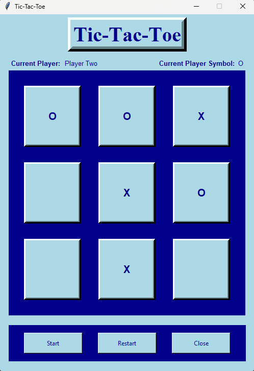

<h1 align="center">:space_invader: Tic-Tac-Toe :space_invader:</h1>

    Tic&ndash;Tac&ndash;Toe game where the user can play against the AI or another Human player

---
<!-- instruction section -->
<h2 align="center">:scroll: Instructions of how to run program :scroll:</h2>

&nbsp;**Option 1:** Programming tools Python and tkinter python library installed

    1.) Run the executable file named Tic-Tac-Toe.exe to open the GUI (Graphical User Interface) for the program

    2.) Have fun playing Tic-Tac-Toe!

&nbsp;**Option 2:** No programming tools installed on running computer

    1.) Click on the link provided below. 
    This link will go to a Google Drive account and will then automatically download and unzip the zip folder called TicTacToe. 
    This folder will contain all the data that the program needs

    2.) Open the folder that was just created called TicTacToe

    3.) Run the executable file named Tic-Tac-Toe.exe

    4.) Have fun playing Tic-Tac-Toe!
&nbsp;<a href="https://drive.google.com/file/d/1nb5TkntuTgk74Dntvu3WaWGPJ3-PL8i4/view?usp=drive_web">Play Tic-Tac-Toe!</a>

---
<h2 align="center">:camera: Project Images :camera:</h2>

**Startup** 

**Choose Opponent** 

**Mid Game** 

**Game Over** 

<!-- footer section -->

    
:arrow_up: <a href="#space_invader-tic-tac-toe-space_invader">Back to top</a> :arrow_up:

