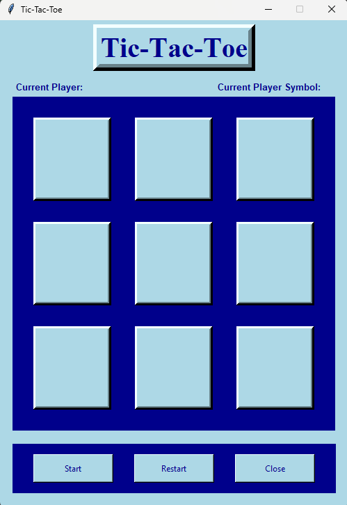

<h1 align="center">:space_invader: Tic-Tac-Toe :space_invader:</h1>

    Tic&ndash;Tac&ndash;Toe game where the user can play against the AI or another Human player

---
<!-- instruction section -->
<h2 align="center">:scroll: Instructions of how to run program :scroll:</h2>

<h3>Downloading The Project Folder</h3>

&nbsp;**Option 1:** Inclusively download this project along with entire portfolio from home page

    1.) On portfolio homepage, open the dropdown box called '<> Code'

    2.) Within the dropdown box, click on Download ZIP

    3.) Open the zip file that was just downloaded

    4.) Unzip the file downloaded by clicking 'Extract all'

&nbsp;**Option 2:** Exclusively download the Chess project

    1.) Click on the link provided below

    2.) Download TicTacToe.zip that was pulled up on Google Drive after clicking link

    3.) Open the zip file that was just downloaded

    4.) Unzip the file downloaded by clicking 'Extract all'

&nbsp;<a href="https://drive.google.com/file/d/1CVZ4yPeWwz88InlvmyA5er6Uf9FkRBXM/view?usp=drive_link">Download Tic-Tac-Toe!</a>

<h3>Running The Program</h3>

&nbsp;*Currently works only on Windows OS - macOS version coming soon*

    1.) Open the folder called TicTacToe

    2.) Run the executable file named 'Tic-Tac-Toe.exe'

    3.) Have fun playing Tic-Tac-Toe!

---
<h2 align="center">:camera: Project Images :camera:</h2>

**Startup** 

**Choose Opponent** 

**Mid Game** 

**Game Over** 

<!-- footer section -->

    
:arrow_up: <a href="#space_invader-tic-tac-toe-space_invader">Back to top</a> :arrow_up:

