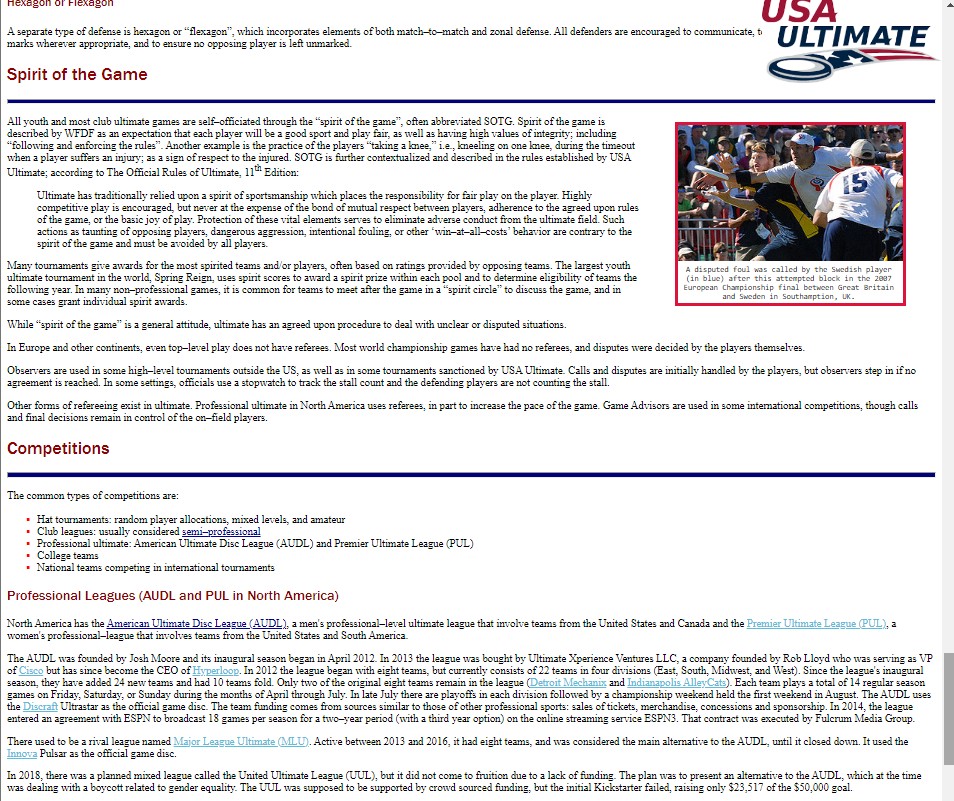

<h1 align="center">:flying_disc: Ultimate Frisbee Wiki :flying_disc:</h1>

    Customized Ultimate Frisbee Wiki page

---
<!-- instructions section -->
<h2 align="center">:scroll: Instructions of how to run program :scroll:</h2>

<h3>Downloading The Project Folder</h3>

&nbsp;**Option 1:** Inclusively download this project along with entire portfolio from home page

    1.) On portfolio homepage, open the dropdown box called '<> Code'

    2.) Within the dropdown box, click on Download ZIP

    3.) Open the zip file that was just downloaded

    4.) Unzip the file downloaded by clicking 'Extract all'

&nbsp;**Option 2:** Exclusively download the Chess project

    1.) Click on the link provided below

    2.) Download Account_Manager.zip that was pulled up on Google Drive after clicking link

    3.) Open the zip file that was just downloaded

    4.) Unzip the file downloaded by clicking 'Extract all'

<a href="https://drive.google.com/file/d/16hXSLftC0Glup5kM5gTEMibvyPDj5bYr/view?usp=drive_web">Download Ultimate Frisbee Wiki</a>

<h3>Running The Program</h3>

    1.) Open the folder called Ultimate_Frisbee_Wiki that was downloaded

    2.) Run the HTML file named ultimate_frisbee.html
    
    3.) Program will open with your default browser

---
<!-- project images section -->
<h2 align="center">:camera: Project Images :camera:</h2>

    

    

    

    

    

    

    

    

    

 

<!-- footer section -->

    
:arrow_up: <a href="#flying_disc-ultimate-frisbee-wiki-flying_disc">Back to top</a> :arrow_up:

