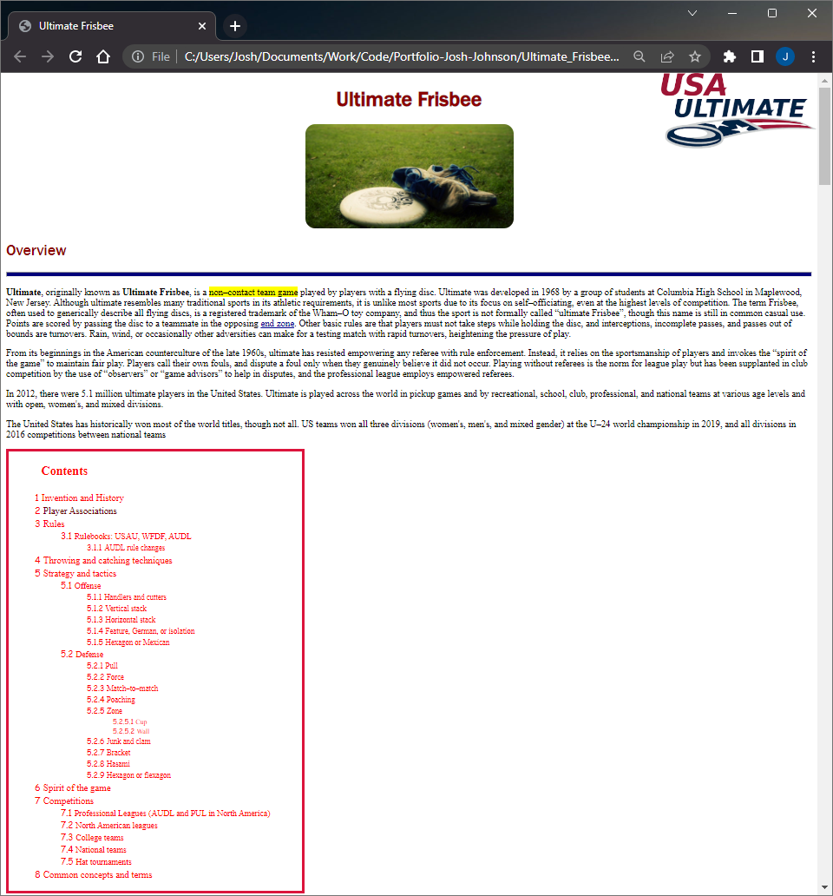
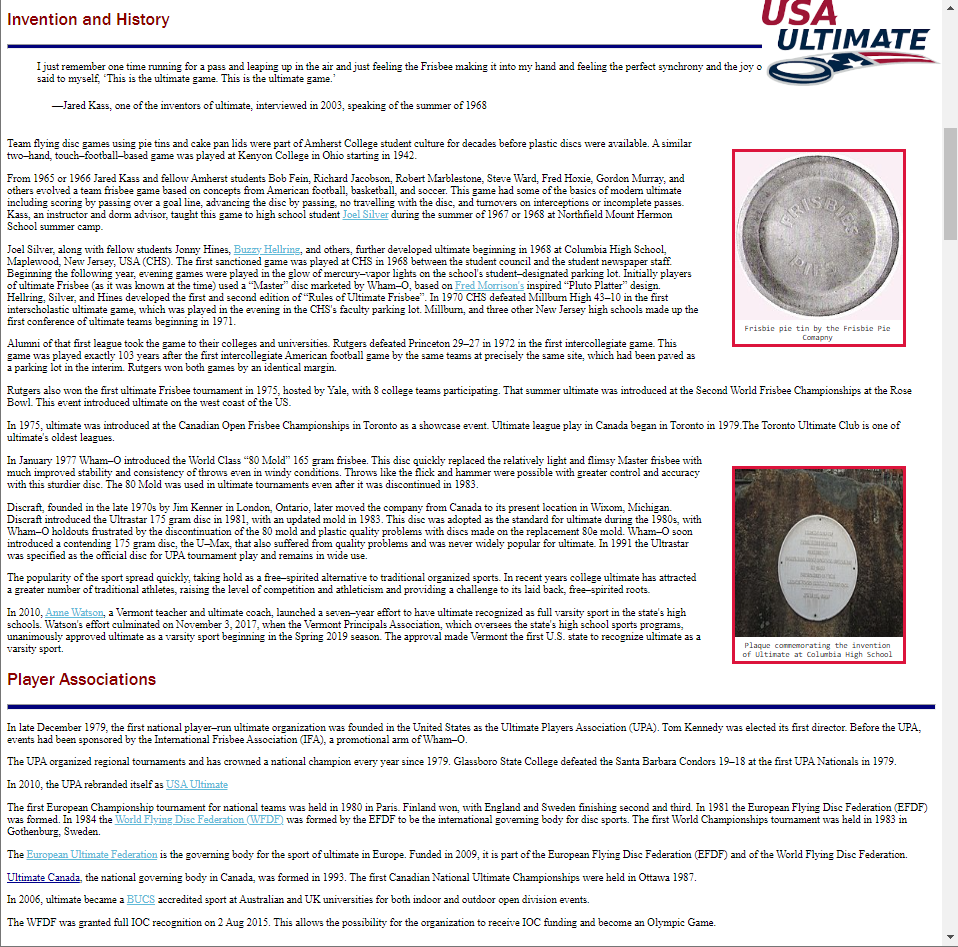
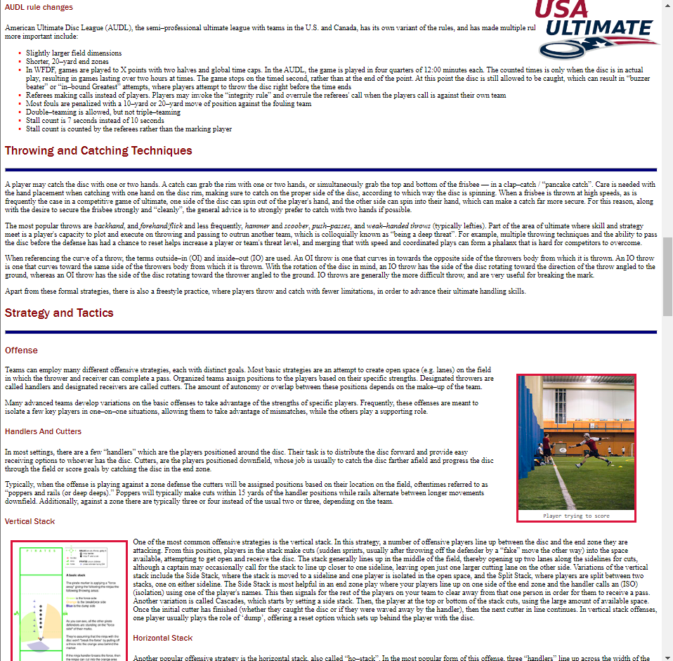
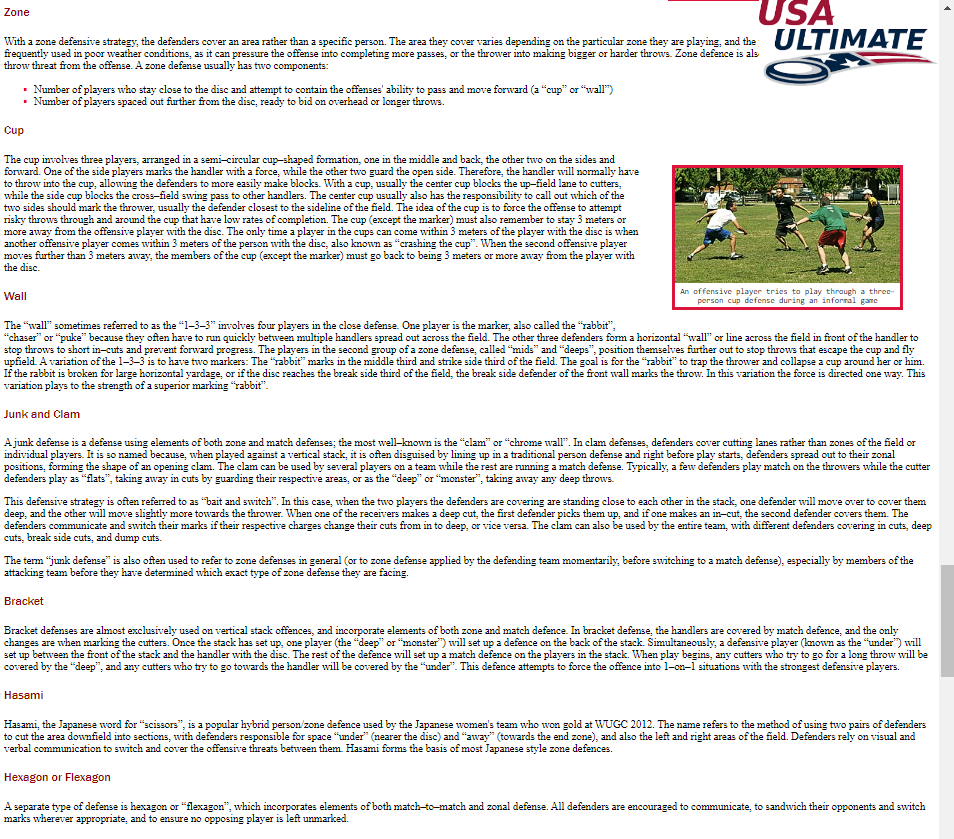
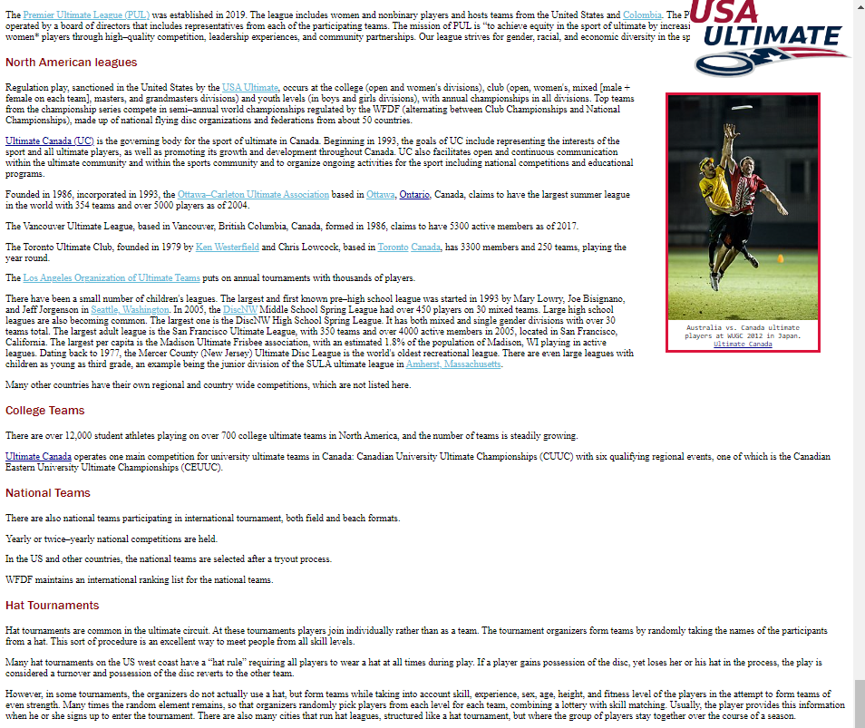

<h1 align="center">:flying_disc: Ultimate Frisbee Wiki :flying_disc:</h1>

    Customized Ultimate Frisbee Wiki page

---
<!-- instructions section -->
<h2 align="center">:scroll: Instructions of how to run program :scroll:</h2>

    1a.) Click link below to download project folder exclusively from Google Drive

    or

    1b.) Download project folder inclusively with all portfolio content from home page

    2.) Open the HTML file named ultimate_frisbee.html
    
    3.) Program will open with your default browser
<a href="https://drive.google.com/file/d/1CYNFLRJeZxOOBC47a4tyrkF_iSUUDISn/view?usp=drive_web">Download Ultimate Frisbee Wiki Project</a>

---
<!-- project images section -->
<h2 align="center">:camera: Project Images :camera:</h2>

    

    

    

    

    

    

    

    

    

 

<!-- footer section -->

    
:arrow_up: <a href="#flying_disc-ultimate-frisbee-wiki-flying_disc">Back to top</a> :arrow_up:

